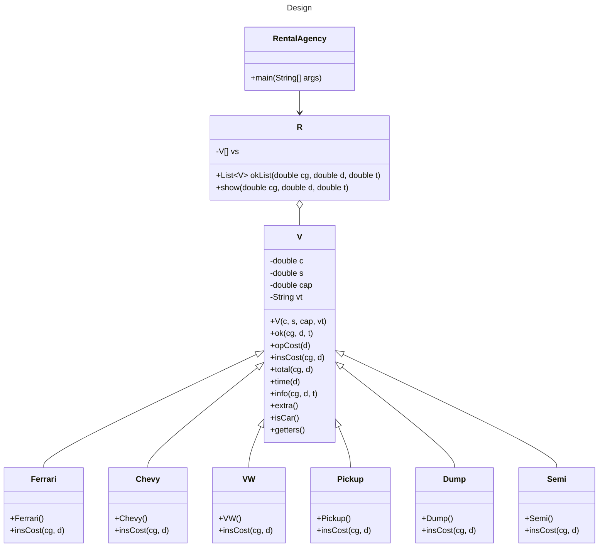

# CSA-hw
Chapter 9 Rental Agency

```mermaid
---
title: Design
---
classDiagram
    direction TB
    
    class RentalAgency {
        +main(String[] args)
    }
    
    class R {
        -V[] vs
        +List~V~ okList(double cg, double d, double t)
        +show(double cg, double d, double t)
    }
    
    class V {
        -double c
        -double s
        -double cap
        -String vt
        +V(c, s, cap, vt)
        +ok(cg, d, t)
        +opCost(d)
        +insCost(cg, d)
        +total(cg, d)
        +time(d)
        +info(cg, d, t)
        +extra()
        +isCar()
        +getters()
    }
    
    %% Car Classes
    class Ferrari {
        +Ferrari()
        +insCost(cg, d)
    }
    
    class Chevy {
        +Chevy()
        +insCost(cg, d)
    }
    
    class VW {
        +VW()
        +insCost(cg, d)
    }
    
    %% Truck Classes
    class Pickup {
        +Pickup()
        +insCost(cg, d)
    }
    
    class Dump {
        +Dump()
        +insCost(cg, d)
    }
    
    class Semi {
        +Semi()
        +insCost(cg, d)
    }
    
    RentalAgency --> R
    R o-- V
    
    V <|-- Ferrari
    V <|-- Chevy
    V <|-- VW
    
    V <|-- Pickup
    V <|-- Dump
    V <|-- Semi
```
